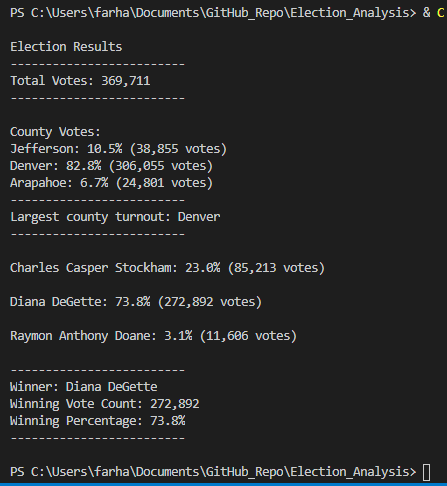
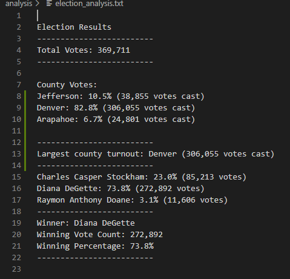

# Election_Analysis

## Project Overview
A Colorado Board of Elections employee requested to perform an audit of the election results and report with the following results:
  1. Total number of votes cast.
  2. Complete list of candidates who received the votes. 
  3. Total number of votes each candidate received. 
  4. Percentage of votes each candidate won. 
  5. Winner of the election based on popular vote. 
  6. Voter turnout for each county
  7. Percentage of votes from each county out of the total count
  8. County with the highest turnout

## Resources
* Data Source: election_results.csv
* Software: Python 3.7, Visual Studio Code, 1.52.1

## Results
The analysis shows that there was a total of 369,711 votes cast. 
The CSV file contained votes from three counties: Jefferson, Denver, and Arapahoe. The vote spread between the counties is the following way:
  * Jefferson county accounts for 10.5% of votes with 38,855 votes cast
  * Denver county accounts for 82.8% of votes with 306,055 votes cast
  * Arapahoe county accounts for 6.7% with 24, 801 votes cast
Effectively, the county with the highest voter turnout is Denver. 

The votes are shared between three candidates:
  * Charles Casper Stockham, who received 23.0% of the votes with 85,213 votes.
  * Diana Degette, who received 73.8% of the votes with 272,892 votes.
  * Raymon Anthony Doane, who received 3.1% of the votes with 11,606 votes. 

Diana DeGette won the election with 73.8% of the vote.  

## Challenge Deliverables: 
### Deliverable 1:

### Deliverable 2: 

## Summary:
The script of the analysis is fully applicable to for any election provided that key modifications are made to the script. The following modifications are advised: 
  1. Modify the path of the file with the data if the file contains similarly formatted csv data. Current script uses the indirect method to locate the specified CSV file in the Resources directory: `file_to_load = os.path.join("Resources", "election_results.csv")`
  2. 
